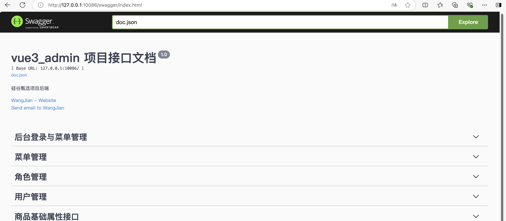

# 硅谷甄选前端项目后端 API

使用 Golang 实现的硅谷甄选后端 API，已实现老师上课使用的所有 API，欢迎大家提提建议。

## 已实现的 API

### 后台登录与用户信息

- [X] 用户登录接口（/admin/acl/index/login）
- [X] 用户登出接口（/admin/acl/index/logout）
- [X] 用户信息接口（/admin/acl/index/info）

### 菜单管理

- [X] 获取菜单列表接口（/admin/acl/permission）
- [X] 角色分配权限接口（/admin/acl/permission/doAssign）
- [X] 删除菜单接口（/admin/acl/permission/remove/{id}）
- [X] 新增菜单接口（/admin/acl/permission/save）
- [X] 根据角色获取菜单接口（/admin/acl/permission/toAssign/{roleId}）
- [X] 更新菜单接口（/admin/acl/permission/update）

### 角色管理

- [X] 删除角色接口（/admin/acl/role/remove/{id}）
- [X] 新增角色接口（/admin/acl/role/save）
- [X] 更新角色接口（/admin/acl/role/update）
- [X] 获取角色分页列表（/admin/acl/role/{page}/{limit}）

### 用户管理

- [X] 用户分配角色接口（/admin/acl/user/doAssignRole）
- [X] 删除用户接口（/admin/acl/user/remove/{id}）
- [X] 用户新增接口（/admin/acl/user/save）
- [X] 用户角色分配接口（/admin/acl/user/toAssign/{adminId}）
- [X] 更新用户接口（/admin/acl/user/update）
- [X] 获取用户分页列表（/admin/acl/user/{page}/{limit}）

### 商品基础属性接口

- [X] 删除基础属性接口（/admin/product/deleteAttr/{attrId}）
- [X] 获取分类下已有的属性与属性值接口（/admin/product/attrInfoList/{c1Id}/{c2Id}/{c3Id}）
- [X] 添加或者修改已有的属性的（/admin/product/saveAttrInfo）

### 品牌管理

- [X] 删除品牌接口（/admin/product/baseTrademark/remove/{id}）
- [X] 新增品牌接口（/admin/product/baseTrademark/save）
- [X] 更新品牌接口（/admin/product/baseTrademark/update）
- [X] 获取品牌分页列表接口（/admin/product/baseTrademark/{page}/{limit}）
- [X] 获取全部品牌数据（/admin/product/baseTrademark/getTrademarkList）

### 上传文件

- [X] 上传文件接口（/admin/product/fileUpload）

### 商品分类接口

- [X] 获取一级分类接口（/admin/product/getCategory1）
- [X] 获取二级分类接口（/admin/product/getCategory2/{id}）
- [X] 获取三级分类接口（/admin/product/getCategory3/{id}）

### 商品 SPU 接口

- [X] 获取SPU分页列表（/admin/product/{page}/{limit}
- [X] 获取全部销售属性（/admin/product/baseSaleAttrList）
- [X] 新增SPU（/admin/product/saveSpuInfo）
- [X] 更新SPU（/admin/product/updateSpuInfo）
- [X] 删除SPU（/admin/product/deleteSpu/{spuId}）

### 商品 SKU 接口

- [X] 获取某个SPU下的全部的售卖商品的图片数据（/admin/product/spuImageList/{spuId}）
- [X] 获取某个SPU下的全部的已有的销售属性接口（/admin/product/spuSaleAttrList/{spuId})
- [X] 新增SKU（/admin/product/saveSkuInfo）
- [X] 根据SPU ID查询SKU（/admin/product/findBySpuId/{spuId}）
- [X] 获取商品 SKU 分页列表（/admin/product/list/{page}/{limit}）
- [X] 商品上架接口（/admin/product/onSale/{skuId}）
- [X] 商品下架接口（/admin/product/cancelSale/{skuId}）
- [X] 商品详情接口（/admin/product/getSkuInfo/{skuId}）
- [X] 删除商品接口（/admin/product/deleteSKU/{skuId})


## 不同

已知的和老师前端实现不同地方如下，其它地方同学如果发现和老师的不同，请参考[我实现的前端代码](https://github.com/WangJian3306/vue3_admin_template.git)进行调整。

1. 本项目实现所有 API 接口都是进行`Token`验证的。

   老师上课实现的路由守卫已经自动全部都带了`Token`，不用担心。在使用`swagger`时需要先登录结果获取`token`，稍微麻烦些。

2. 文件上传接口`/admin/product/fileUpload`

   本项目实现的文件上传接口需要验证`Token`，`<el-upload>` 组件上传时，需使用`headers`属性携带`Token`请求头。
   
   ```html
   <template>
       <el-upload action="/admin/product/fileUpload" :headers="headers"></el-upload>
   </template>
   <script setup>
       // el-upload 上传 http 请求头，携带 Token 
       // 引入用户相关的仓库
       import useUserStore from '@/store/modules/user'
       // 获取用户相关的小仓库：获取仓库内部token，登录成功以后携带给服务器
       const userStore = useUserStore()
       const headers = {Token: userStore.token}
   </script>
   ```

3. 前端`SaleAttr interface`中的`baseSaleAttrId`字段数据类型为`number`，页面使用不兼容时使用`Number()`进行数据类型转换
   
   ```javascript
   // 销售属性对象
   export interface SaleAttr {
     id?: number
     spuId?: number
     baseSaleAttrId: number // 这里是 number，没有 string
     saleAttrName: string
     spuSaleAttrValueList: SpuSaleAttrValueList
     flag?: boolean
     saleAttrValue?: string
   }
   
   // 准备一个新的销售属性对象：将来带给服务器即可
   let newSaleAtrr: SaleAttr = {
      baseSaleAttrId: Number(baseSaleAttrId), // 这里是使用 Number() 进行数据类型转换
      saleAttrName,
      spuSaleAttrValueList: [],
   }
   ```

## 如何使用

需要本地电脑安装 `docker` 和 `docker-compose`，如何安装和使用`docker`请参考尚硅谷的`docker`课程。

1. 克隆本项目到本地目录
   ```
   git clone https://github.com/WangJian3306/vue3_admin_backend.git
   ```
2. 使用`docker-compose`一键启动
   ```
   cd vue3_admin_backend
   docker-compose up --build -d
   ```
3. 运行成功后就可以浏览器器访问 `swagger`地址进行测试，`swagger`地址：`http://127.0.0.1:10086/swagger/index.html#/`
   

4. `swagger`地址能够访问，说明程序启动没问题，可以使用本地地址（127.0.0.1:10086）给前端调用了

## 鸣谢：

感谢尚硅谷和贾成豪老师录制的前端视频课程免费给大家学习。

（完）